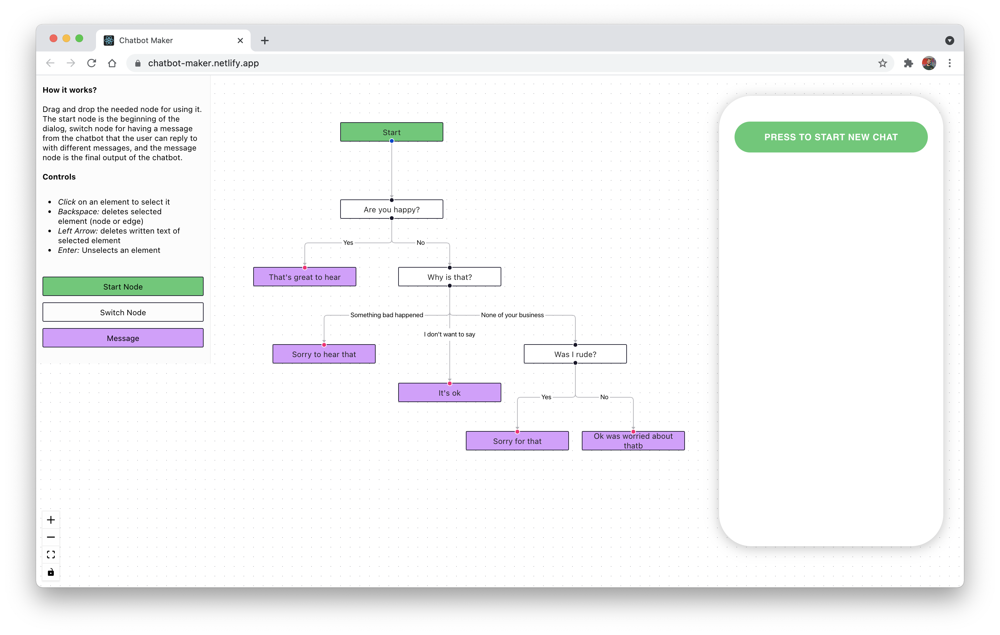
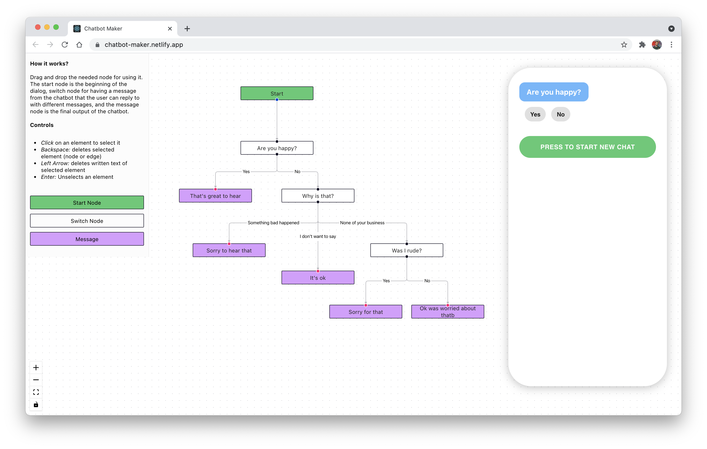
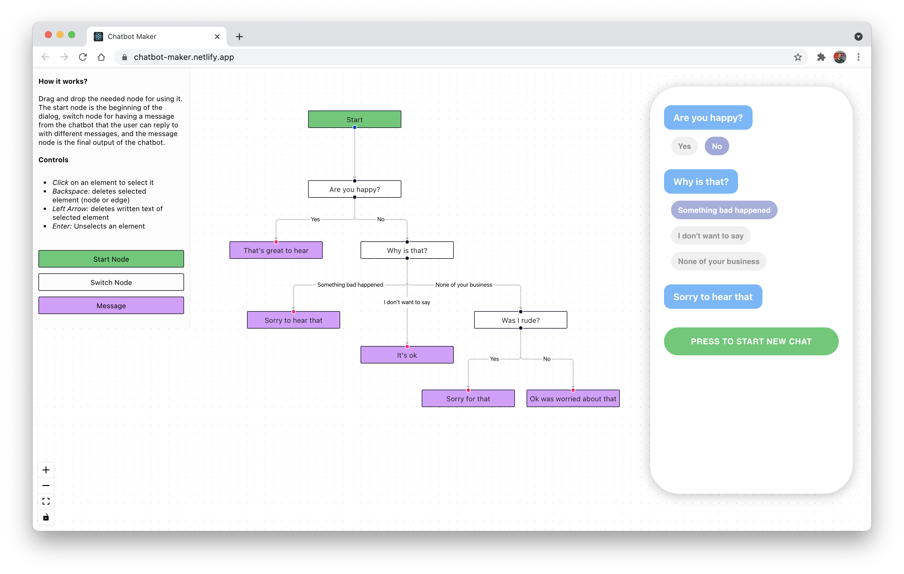
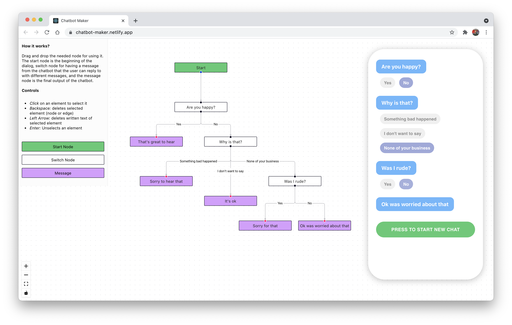
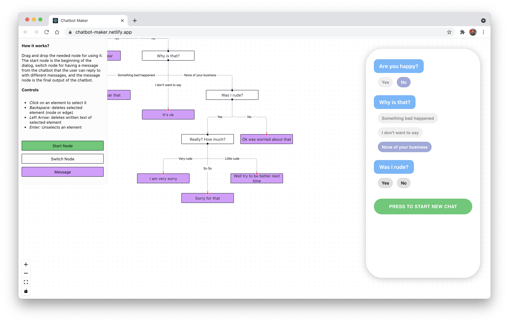
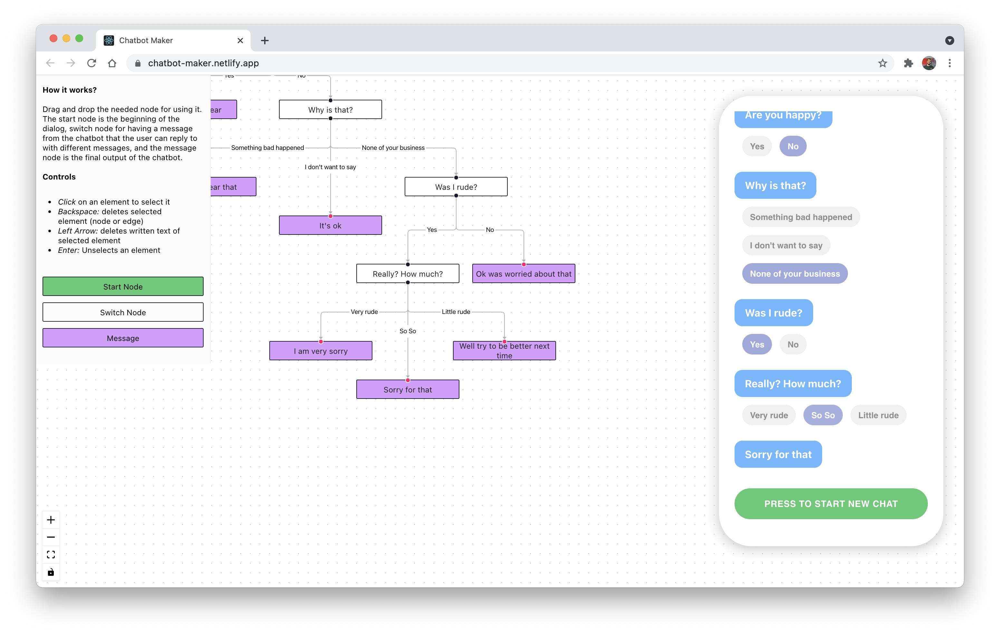

# Chatbot Maker

Easy-to-use chatbot maker, that creates a chatbot by dragging and dropping visual rectangular blocks and arrows to form the chat flow. In the chat flow, arrows represent the possible answers of the end-user and the rectangular blocks represent the possible answers/questions of the chatbot that is based on the user responses.

Chatbot maker can be accessed from [here](https://chatbot-maker.netlify.app/).

## Example Chatbot

The following is an example chatbot; created using chatbot maker.

Clicking the "Press to Start New Chat" button will start the chatbot in the window on the right.

The chatbot user can click on any of the replies to continue in the chat flow.

Pressing the button again restarts the chat from the beginning. In the following snapshot, we followed a different path in the chat flow.

### Dynamic Chat Flow Change

The chatbot editor is dynamic. This means that the chatbot creator can change the chat flow graph mid-execution (i.e., mid-chatting).

Selecting "Yes" now, will result in producing the new replies:

Try creating a chatbot at [chatbot-maker.netlify.app](https://chatbot-maker.netlify.app/).

## Available Scripts

In the project directory, you can run:

### `yarn start`

Runs the app in the development mode.\
Open [http://localhost:3000](http://localhost:3000) to view it in the browser.

The page will reload if you make edits.\
You will also see any lint errors in the console.

### `yarn build`

Builds the app for production to the `build` folder.\
It correctly bundles React in production mode and optimizes the build for the best performance.

The build is minified and the filenames include the hashes.\
Your app is ready to be deployed!

See the section about [deployment](https://facebook.github.io/create-react-app/docs/deployment) for more information.
